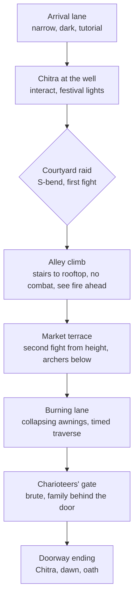

# Chapter 1 quality audit

Audited 2026-09-02 against `game/client-scripts/chapter-1.js`, `world-layout.json`, `game/server/src/**`, the QA screenshots in `site/tests/browser-artifacts/`, and the intent in `site/docs/chapter-1-game-handoff.md`. Two independent GPT-5.6 Sol reviewers covered environment/rendering and locomotion/netcode; their findings are merged below and marked where they diverged from mine.

## Verdict

You are not overthinking it. The gap is real and it is mostly art direction and level design, not engine limits. The runtime is a competent *systems* build (server authority, signed progress, i18n, voice cache, tests) wrapped around a *placeholder* world: primitive boxes for houses, cones for fire, spheres for smoke and stars, one flat-colour sky sphere, one 22×82 m slab of road, and a dead-straight 60 m corridor. Every one of those was a reasonable greybox step that was never replaced. The handoff asked for an S-shaped street and "authored rather than untouched template"; what shipped is a straight lane.

| Dimension | Score /10 | One-line reason |
| --- | --- | --- |
| Environment / art | 2.5 | Greybox primitives still on screen; no IBL, no post, no particles, no textures beyond one road tile |
| Level design | 3 | Straight corridor, three fights in a row, no verticality, no reveal, no S-bend as specified |
| Movement / camera feel | 4.5 | Works, but 20 Hz server-only motion with no prediction; animation states pop; footsteps and gait not phase-locked |
| Combat feel | 5 | Readable telegraphs and lock-on, but no hit-stop, weak impact, primitive VFX |
| Code quality | 4 | One 1,200-line IIFE, 300–2,000-char lines, duplicated constants client/server, stub modules |
| Systems / netcode / security | 7.5 | Genuinely solid: sanitised input, signed tokens, reconnect, tests |
| Shippable today | 1 | Public site cannot reach the game server (see Deploy) |

## 1. Environment and rendering

Evidence is `chapter-1.js:line`.

| # | Severity | Finding | Fix |
| --- | --- | --- | --- |
| E0 | Blocker | **The sky sphere hides the horizon you built.** The sky is an opaque, depth-writing `StandardMaterial` sphere scaled `[92,70,92]` at `(0,24,-6)` (931), so its inner wall is only 46 m out in X/Z. The "Distant palace" wall, columns and dome (909–918, z ≈ −58), the moon (963, z = −62) and four of the five stars are *outside* that shell and are culled by the depth test. Fog at 80 m still leaves 82 % visibility, so fog is not the reason. Verified numerically. Both screenshots show the result: a blank indigo card behind the arch. | Delete the sphere. Load `moonless_golf_2k.hdr` (ledgered, unused) → `pc.EnvLighting.generateSkyboxCubemap` → `scene.skybox`, and `generateAtlas` → `scene.envAtlas`. The skybox pass has no depth footprint and gives IBL for free (see E3). |
| E0b | Blocker | **Ground texture repeats every ~30 m.** `diffuseMapTiling (0.75, 2.75)` on a 22 × 82 m box (741, 932) plus `ADDRESS_MIRRORED_REPEAT` (740). That is the giant light/dark chessboard slabs in every capture. | Tiling ≈ `(11, 41)` for a 2 m footprint, `ADDRESS_REPEAT`, a detail normal map, and macro variation via vertex colour or a second blended tile. |
| E1 | Blocker | **Houses are coloured boxes.** `buildScene` loops `primitive("box","Left house"…)` every 6 m (934–940). The Quaternius wall/roof modules are placed *in front* of them with a visible gap so roofs float. Screenshot shows flat magenta/indigo slabs behind plaster façades. | Build each house from the kit: `Wall_Plaster_Straight` × N + corner + `Roof_RoundTiles` at matching grid pitch (kit is 4 m grid), scale 1, no arbitrary 1.42 scale. Delete the box houses entirely. |
| E2 | Blocker | **Fire = two cones, smoke = four spheres, stars = spheres** (777–786, 963). Reads as toy immediately. | PlayCanvas `particlesystem` component with Kenney smoke sprites (already ledgered). Emissive additive flame sprite + point light flicker. Stars via skybox. |
| E3 | Blocker | **No image-based lighting.** Sky is `CULLFACE_FRONT` sphere with a flat emissive (928, 931). `moonless_golf_2k.hdr` sits unused in the ledger. Flat ambient `(.24,.27,.44)` gives no directional bounce, so everything looks lit by a fluorescent tube. | Prefilter the HDR to a cubemap (PlayCanvas `EnvLighting.generatePrefilteredAtlas`), set `scene.envAtlas` + `scene.skybox`, drop ambient to near-black and let IBL carry it. Exposure and ACES are already on. |
| E4 | Major | **No post-processing.** Engine 2.21 ships `CameraFrame` (bloom, SSAO, TAA, grading, vignette, DOF). Vignette is faked with CSS (`#vignette`). | `new pc.CameraFrame(app, camera.camera)` with bloom 0.03–0.05 for fires, SSAO for contact, slight cool/warm grade. Ten lines, biggest visual delta per line in the project. |
| E5 | Major | **Every hand-built surface is diffuse-only** (`material()` 520–524): no normal, roughness, AO, or emissive maps; `metalness .05 gloss .25` on everything, so plaster, gold, cloth and iron all have the same sheen. Verified the kit GLBs *do* still carry base/normal/metallicRoughness maps after optimisation, so the flat look comes entirely from the ~200 primitives around them (houses, turn walls, road, bunting, sky). | Replace primitives with kit meshes (E1) and author 3–4 tiling PBR materials (sandstone, lime plaster, packed earth, cloth) with normal maps from ambientCG/Poly Haven (CC0) for whatever must stay procedural. |
| E6 | Major | **Ground is one box with one texture** (932), pebbles are six spheres (933). Seams and stretching are visible in the 1920×1080 capture. | Split into road slabs with a second tiling material and a blended edge; add decals (cart ruts, ash, rug edges), and a step down to side lanes. |
| E7 | Major | **Bunting is 27 flat boxes on a straight cord** (876–884). In screenshots it reads as floating confetti. | Triangular quads with a cloth texture, catenary sag, tiny per-frame sway, and a light-cookie/shadow so it grounds. |
| E8 | Major | **Cultural mismatch.** Medieval European village kit (round-tile roofs, shutters, wagon) dressed with painted "sun emblems" (769–775) for an ancient-India charioteers' quarter. | Short term: retexture kit walls to lime-plaster/ochre, replace tiled roofs with flat terraces + parapets (box + cornice looks *more* correct here), add torana-style door frames, brass lamps, clay pots, awnings. Medium term: Sketchfab CC-BY Indian street packs or Kenney/Quaternius "desert" sets. |
| E8b | Major | **Lighting is daylight fill with a headlight.** Ambient `(.24,.27,.44)` at exposure 1.36 (927) is too bright for night, so nothing falls into shadow. A warm omni "hero fill" is parented to the camera (970), which flattens every face and body like a phone torch. Fire lights have constant intensity; only the cone mesh pulses (1130), so nothing flickers. Kit-mesh scales are all different (1.42 walls, 1.28 doors, 1.34 shutters, 1.45/1.38 roofs), so a snap-together kit no longer snaps. | Ambient ≈ `(.03,.04,.09)`, exposure ~1.0, delete the camera light, flicker `light.intensity` per frame with noise, kit at scale 1.0 on its 4 m grid. |
| E9 | Minor | **Twelve+ omni lights, no clustered-light tuning** (785, 792, 921, 964, 970). Fine on desktop, but `findByTag("fire")` and `findByTag("smoke")` walk the whole scene graph every frame (1130–1131). | Cache the fire/smoke entity arrays once at build time. |
| E9b | Minor | **Static batching never batches a single GLB.** `batchStaticEnvironment()` runs at 967, models arrive async at 746–749, and `instantiateModel` never sets `batchGroupId`. Only the primitives are batched. Harmless today, defeats the intent. | Assign `render.batchGroupId` inside `instantiateModel` and call `batcher.generate()` after the last load. |
| E9c | Minor | `road.receiveShadows = false` (932), yet a character shadow appears on the road in the arrival capture. Either the batcher ignores the flag or the blob is the fill light. Not determined. | Check; the road *should* receive the moon shadow. |
| E10 | Minor | `groundAnimatedCharacter` runs `findComponents("render")` + regex on every character every frame (566–578). | Cache the footwear mesh instances on the root at upgrade time. |
| E11 | Minor | Shadow bias `.22` with 1024 map over 42 m produces the soft detached shadow in the arrival shot (965). | `shadowResolution 2048`, bias `.05`, `normalOffsetBias .02`, cascades 2. |

## 2. Level design and story phases

Handoff (§Level layout) asked for **one compact S-shaped street with four connected spaces**. `world-layout.json` is a rectangle `x∈[-10.4,10.4], z∈[-36.5,24.5]` with two low "turn walls" that do not actually turn the player. The three encounters happen in the same corridor 20 m apart. Combat totals under 25 s for an accurate player (completion report §Scope).

**Recommended re-cut (keeps the locked story beats, elongates ground, adds phases):**

| Phase | Ground | Purpose | New systems needed |
| --- | --- | --- | --- |
| Arrival lane | 2.5 m wide, 30 m, two bends | Teach camera and move in a tight space; reveal the quarter at the exit | None |
| Well square | 14×14 m open | Chitra beat, festival mood, first lights | None |
| Courtyard raid | S-bend around the cart | Existing fight 1 | Existing |
| Alley climb | `Stairs_Exterior_Straight` × 3, rooftop 6 m up | Breather, vista of the burning market, waypoint from above | Y in collision (currently 2D only) |
| Market terrace | Two-level | Fight 2 with height advantage for bow | Y collision, archer aim in Y |
| Burning lane | 25 m, awnings fall on a timer | Pressure without new enemy types | Scripted prop animation |
| Gate | Existing doorway fight | Fight 3 | Existing |

Total walkable path grows from ~60 m to ~180 m without new enemy AI. The single blocking change is adding Y to the server collision model (`collision.ts` is 2D boxes). A cheap version: per-region floor height table keyed by XZ rectangle, no slopes.

## 3. Movement, camera, animation

| # | Severity | Finding | Fix |
| --- | --- | --- | --- |
| M1 | Major | **No client prediction.** Input is sent at 50 ms (518), server ticks at 50 ms (`index.ts:124`), snapshot lerps at rate 20 (1090). Budget: 0–50 ms send quantisation + RTT + 0–50 ms tick quantisation + 50–150 ms lerp settle + a frame. About 120 ms typical on localhost, 300 ms worst, plus real RTT once deployed. Humans notice above ~70 ms. Animation lags further because `playerAnim` is derived from snapshot velocity (1095) plus a 0.12 s crossfade. `game/research/third-person-locomotion-camera.md` already prescribes prediction + reconciliation; it was written and not implemented. | For a single-player story game: run the same `ChapterSimulation` in the browser for movement, send inputs, reconcile on snapshot (server still owns damage, phase, tokens). The sim is already pure TypeScript with no Node deps except `randomUUID`. |
| M2 | Major | **Velocity derived from snapshot deltas** (418–422) and zeroed on any jump above 9.1 m/s or phase change, extrapolated ≤75 ms. This is what causes the stop-and-slide and the 20 Hz shimmer at 120 fps. | Snapshot interpolation buffer (render 100 ms in the past between two real snapshots) for enemies; prediction for the player. |
| M3 | Major | **Three yaws** (`lookYaw`, `yaw`, `visualYaw`) with different exponential rates (1085–1100). The reticle ray uses the smoothed `yaw`, so aim lags the mouse by design. | Mouse → aim yaw immediately; smooth only the body yaw. |
| M4 | Major | **Animation is threshold-switched, not blended.** `walk` and `sprint` both map to `Jog_Fwd_Loop` (677) at time-scale .68–1.82, so every Shift press crossfades the clip *against itself* from frame 0 and the legs snap. `Walk_Loop` and `Sprint_Loop` exist in `UAL1_Standard.glb` and are never used. 0.12 s crossfades everywhere (711); `Roll` (1.47 s) plays under a 0.65 s dodge. No upper/lower split, so aiming while moving plays a static aim pose and feet slide. | PlayCanvas anim blend tree (1D on speed: Idle/Walk/Jog/Sprint using the clips already shipped), second layer masked to spine-up for aim/fire, dodge clip trimmed to 0.65 s. |
| M5 | Major | **Presses can be silently dropped.** `acceptInput` overwrites `this.input` (`simulation.ts:176–182`); if two 50 ms client sends land between two 50 ms server ticks (timer jitter guarantees this periodically), the first frame's `pressed` (dodge/fire/melee/interact) is lost. The client has already cleared `state.pressed` (515), so the player feels "dodge didn't register". | Accumulate `pressed` across inputs until consumed, or queue inputs per tick. Disappears entirely if the sim runs locally (M1). |
| M6 | Minor | Dodge is not locally predicted while melee/fire are (`localAction` 499 vs 1094). The most latency-sensitive action gets the full round trip. | `localAction = "dodge"` on Space, or M1. |
| M7 | Minor | Footsteps on a fixed interval (1108–1111) not on foot contact. `groundAnimatedCharacter` re-grounds the root on the lowest foot every frame (566–578), so during jog flight phase the whole body sinks toward the 0.11 clamp and rises again, fighting the clip's own bob. | Anim events on the clip; apply ground offset only when idle/aiming. |
| M8 | Minor | Camera has no spring; anchored 1:1 to the lerped player position (1115–1119), so every 20 Hz wobble becomes a world wobble. `lookAt` every frame with an instant occlusion pull-in quantised to 0.16 m steps and 3.2 m/s push-out (1070–1080, 1117). | Critically-damped spring (~0.1 s) on pivot and distance; exact ray-vs-AABB slab test; fast in, slow out. |
| M9 | Minor | No hit-stop, no enemy stagger clip, hit spark is six spheres (1023–1031). Melee damage resolves 0.18 s after the server sees the press, the burst fires on the health delta, so impact lands ~250–350 ms after click near the end of the trail with the enemy unmoved. | 40–90 ms `anim.speed` dip on both actors, `Hit_Chest` on enemies (clip exists), sprite burst on local swing timing. |
| M10 | Minor | Enemy facing is `lookAt(pos + velocity)` with no smoothing and a hard swap at 0.18 m/s (1064–1065); separation steering makes the 20 Hz velocity noisy, so raiders twitch. | Smooth yaw with the same `angleDifference` blend the player uses. |

## 4. Code and practices

| # | Finding | Why it matters | Fix |
| --- | --- | --- | --- |
| C1 | `chapter-1.js` is one 1,191-line async IIFE with lines up to 2,010 characters (line 928 is the entire material table). | Unreviewable, undiffable, unformattable. No reviewer can reason about it. | Prettier at 100 cols; split into `scene/`, `character/`, `net/`, `ui/`, `combat/` ES modules bundled by the site's Vite. |
| C2 | `combat-view.js`, `input.js`, `player-controller.js`, `phase-manager.js`, `progress-bridge.js`, `enemy-view.js`, `websocket-client.js` are 1–11 line stubs that nothing imports. | Misleading "readable source" claim in the README. | Delete or make them the real modules from C1. |
| C3 | Gameplay constants duplicated by hand: arrow height 1.42, dot 0.83, 22 m range, speeds 3.2/4.5/6.5, dodge 0.65 (client 726–733, 833–847; server 277, 302–303, 250). `config/chapter-1.json` exists but neither side reads it. | Any tuning change silently desyncs lock-on from hits. | Both sides import the JSON; server validates it at boot. |
| C4 | `primitive()` monkey-patches `castShadows` onto every entity via `Object.defineProperties` (530). | Hidden per-entity property descriptors; surprises anyone reading `entity.castShadows`. | Set `render.castShadows` directly. |
| C5 | Cache-busting via `?v=20260902k` string literals sprinkled through URLs (41, 745–759). | Manual, easy to forget, already inconsistent (`b`, `i`, `k`, `w`, `ch`). | Content-hash filenames from the build. |
| C6 | `document.querySelectorAll("button")` click → `playEffect` (486) plus per-button handlers. | Double sounds on modal buttons. | One delegated handler. |
| C7 | The PlayCanvas Editor project is provenance only; nothing is authored there (`playcanvas-project.md`). The 194 MB project adds process weight without a scene. | Two sources of truth, neither is a scene file. | Either author the level in the Editor and export the scene JSON, or drop the Editor and keep code-first. Code-first plus a `world-layout.json` that also carries visuals is the lazier path. |

## 5. Deploy: the public site cannot run the game

`connect()` (361) defaults to `wss://<hostname>:3210`. The site deploys to Cloudflare via `@cloudflare/vite-plugin` and `@openai/sites-vite-plugin`; nothing in `site/` sets a WebSocket URL, and a Node `ws` tick loop cannot run on Workers. On the public URL the game shows "Reconnecting" forever. Every "verified" run in the completion report was localhost.

Options, cheapest first:

1. Run the simulation in the browser for single-player (M1) and only call a tiny HTTP endpoint to sign progress. Removes the server from the critical path.
2. Host `game/server` on a Fly.io/Render free tier and pass `?ws=wss://…` from the site.
3. Port the sim to a Cloudflare Durable Object.

## 6. What an experienced team would do first (ordered by visual delta per hour)

1. **Delete the sky sphere, fix ground tiling, kill the camera light, drop ambient** (E0, E0b, E8b): two hours, and the palace, moon and stars you already built appear.
2. **IBL + CameraFrame post** (E3, E4): half a day, transforms every screenshot.
3. **Delete box houses, rebuild with kit on grid, flat terraced roofs** (E1, E8): one to two days.
4. **Particle fire/smoke, textured bunting, decals** (E2, E7, E6): one day.
5. **Local simulation + prediction** (M1, M2, §5): one to two days; fixes feel *and* deploy.
6. **Blend tree + masked aim layer** (M4): one day.
7. **S-bend re-cut with alley climb** (§2): two to three days after Y collision.
8. **Module split + Prettier + shared config** (C1–C3): one day, do it before 6 or 6 becomes unmanageable.

Items 1–3 need no gameplay changes and no server changes. If only one week exists, do 1–4.

## Reviewer notes

**Locomotion/netcode reviewer (GPT-5.6 Sol):** agreed on M1–M4, M8; independently found the dropped-press race (M5) and the self-crossfade pop (M4 detail), both confirmed against the code. Its verdict: the single highest-leverage change is to stop simulating the player on the server. The sim is already pure TypeScript; run it in the browser every frame with real `dt`, drive camera and animation from local state, keep the server only for signing progress. That removes M1, M2, M5, M6 and the deploy blocker in one move.

**Environment reviewer (GPT-5.6 Sol):** agreed on E1–E8; independently found the sky-sphere occlusion bug (E0), the 30 m ground tiling (E0b), the camera headlight and daylight ambient (E8b), and the never-batched GLBs (E9b). All confirmed against the code and the numbers. Its verdict: three decisions produce most of the amateur read: the opaque sky shell erasing the horizon, the mirrored 30 m ground tile, and flat materials under daylight ambient plus a camera headlight. Those are one to two days of engineer work in PlayCanvas 2.21. Real Indian architecture, particles, closed houses at kit scale, and a level with a fork and a gate reveal are environment-art work measured in weeks.

**Cultural specifics it added (E8):** the setting is the *charioteers'* quarter and there is not one chariot or horse in the scene. Needed: flat mud-brick roofs with parapets or thatched chhappar, carved wooden pillars, a torana gateway, stepped plinths, rows of clay diyas instead of iron wall torches, brass water pots, cloth canopies, and a rath. Roofs are the cheapest high-impact swap.

**Level shape it proposed (§2 alternative):** (a) arrival courtyard with a stable and chariot yard, (b) a bazaar lane that forks around a well, (c) a raised stepped ghat or terrace giving the archer a vantage, (d) a torana gate reveal onto a second district skyline, which is the palace that E0 currently hides.
